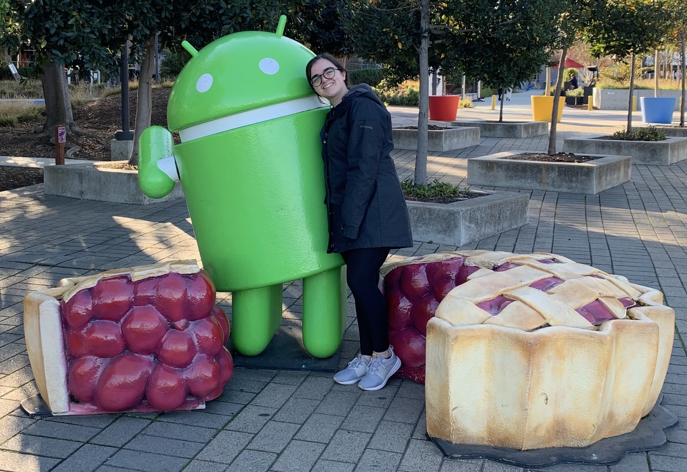

# About Me

## Long Story Short...
Four years ago, I started working at a manufacturing plant for General Motors, first as a co-op student, now as a MES/Database Developer. Working with databases in the manufacturing space sparked a love for data and the endless insights that can result in knowing how to work with data. During the early days of quarantine, I had time to consider where I wanted to take my career next and decided to start working towards a Master's in Data Science. Next, I will be seeking opportunities to apply the knowledge I have gained in the "real world".

## The Whole Story

In 2015, I was graduating high school where I spent my four years taking all the science classes my school offered - Humany Biology, Anatomy, Physics, AP Biology, Chemistry I and II. I had my heart set on being a doctor and I had my heart set on going to Rochester Institute of Technology. The only problem was I ended up being accepted into the Information Systems and Techonology Department in the Web and Mobile Computing degree (previously Information Technology). 

I decided I would try out Web and Mobile Computing (WMC) and look into switching programs if I decided that would be better. My first year, I really enjoyed the WMC program; it was a lot of fun learning how to code and work with databases. I decided to stick with it, but with my free electives and summers I would take classes to meet requirements for medical school, including Organic Chemistry I and II. It would have taken an extra semester or two but I would have been well prepared to take the next steps towards medical school. 

Into my third year of college, I was still taking science courses and doubting my abilities to make it in computing. Then, as the holidays were nearing, signifying the end of the semester was coming, an interview I had with a company finally worked out for me and I was going to start my first co-op in January at General Motors.

Within the first half of my double-block co-op, there were already discussions about my staying on part-time and then continuing on full-time after graduation, which still at least two semesters away. This was the turning point for my career. I decided I would graduate on time and continue working for General Motors as an MES/Database Developer instead of finishing my pseudo-pre-med track.

I have been working for General Motors for over four years, coming up on three years full-time this summer. With the support of my manager, my plant leadership and my family, I will soon also have my Master's in Data Science.

Because we all know the saying "All work and no play makes Jack a dull boy", I like to relax and plan visits/vacations. Also, when I am not working I enjoy playing or snuggling with my dog, slow blinking at my cat, and baking in the kitchen.
